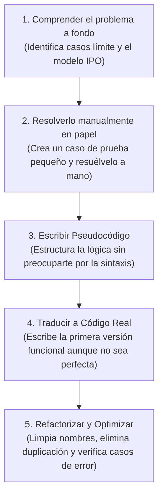

# Módulo 15: Ejercicios de Lógica y Algoritmia Práctica

La única forma de consolidar los fundamentos de programación es enfrentándote a problemas reales que exijan pensar antes de teclear. Esta guía de ejercicios está graduada por niveles de dificultad, cubriendo los conceptos esenciales aprendidos a lo largo de toda la pista.

---

## 🟢 Nivel Básico: Lógica, Tipos y Bucles (Módulos 1 al 5)

### Ejercicio 1: FizzBuzz Parametrizado
El clásico de entrevistas técnicas:
* Escribe una función `fizzBuzz(limite: number): void` que imprima los números del 1 al `limite`.
* Si el número es múltiplo de 3, imprime `"Fizz"`.
* Si el número es múltiplo de 5, imprime `"Buzz"`.
* Si el número es múltiplo de ambos (3 y 5), imprime `"FizzBuzz"`.
* Si no es múltiplo de ninguno, imprime simplemente el número.
* *Pista:* Utiliza el operador módulo (`%`).

### Ejercicio 2: Inversor Manual de Cadenas
Crea una función `invertirTexto(texto: string): string` que invierta una cadena de texto **sin utilizar métodos automáticos como `.reverse()`**:
* Recorre la cadena con un bucle decreciente desde `texto.length - 1` hasta `0`.
* Concatena cada carácter en un nuevo string acumulador y devuélvelo.

### Ejercicio 3: Detector de Palíndromos
Un palíndromo es una palabra o frase que se lee igual hacia adelante que hacia atrás (ejemplo: `"oso"`, `"reconocer"`, `"anita lava la tina"`):
* Crea una función `esPalindromo(frase: string): boolean`.
* Debe ignorar mayúsculas/minúsculas y espacios en blanco.

### Ejercicio 4: Secuencia de Fibonacci (Iterativo vs Recursivo)
La serie de Fibonacci comienza con `0, 1` y cada número siguiente es la suma de los dos anteriores (`0, 1, 1, 2, 3, 5, 8, 13...`):
1. Escribe `fibonacciIterativo(n: number): number` usando un bucle `for`.
2. Escribe `fibonacciRecursivo(n: number): number` utilizando recursión con su caso base.

---

## 🟡 Nivel Intermedio: Funciones, Arrays y Colecciones (Módulos 6 al 10)

### Ejercicio 5: Tres Enfoques para Eliminar Duplicados
Dado el array: `[1, 2, 2, 3, 4, 4, 5, 1, 6]`
Implementa tres funciones distintas para devolver un array con elementos únicos:
1. Usando un bucle tradicional y un array auxiliar.
2. Usando `.filter()` e `.indexOf()`.
3. Usando la estructura de datos moderna `Set`.
*Compara la legibilidad y el rendimiento de los tres métodos.*

### Ejercicio 6: Agrupador por Categoría (*GroupBy* casero)
Dado un array de productos con categorías:

```typescript
const inventario = [
  { nombre: "Manzana", categoria: "Frutas" },
  { nombre: "Lechuga", categoria: "Verduras" },
  { nombre: "Plátano", categoria: "Frutas" },
  { nombre: "Zanahoria", categoria: "Verduras" }
];
```

* Escribe una función usando `.reduce()` que agrupe los productos en un objeto donde las claves sean las categorías:
  ```typescript
  // Resultado esperado:
  // {
  //   Frutas: ["Manzana", "Plátano"],
  //   Verduras: ["Lechuga", "Zanahoria"]
  // }
  ```

### Ejercicio 7: Aplanador Recursivo de Arrays (*Flat* casero)
Dado un array profundamente anidado: `[1, [2, [3, [4]], 5]]`
* Crea una función recursiva `aplanarArray(arr: any[]): any[]` que devuelva `[1, 2, 3, 4, 5]` sin utilizar el método nativo `.flat()`.

### Ejercicio 8: Actualizador Inmutable de Estado
Dado un objeto de configuración con datos anidados:

```typescript
const estadoApp = {
  usuario: {
    id: 10,
    preferencias: {
      tema: "claro",
      notificaciones: { correo: true, push: false }
    }
  }
};
```

* Escribe una función pura `actualizarTema(estado: typeof estadoApp, nuevoTema: string)` que devuelva un nuevo objeto con el tema actualizado a `"oscuro"`, asegurando con una prueba que el objeto original `estadoApp` conserve el valor `"claro"` intacto en memoria.

---

## 🔴 Nivel Avanzado: Algoritmos, Estructuras y Asincronía (Módulos 11 al 14)

### Ejercicio 9: Verificador de Sintaxis con Pila (*Stack*)
* Escribe una función `validarParentesis(expresion: string): boolean` que verifique que todos los pares de `()`, `[]` y `{}` estén correctamente abiertos y cerrados en el orden adecuado.
* Utiliza una estructura de datos de tipo Pila (LIFO) para almacenar los caracteres de apertura.

### Ejercicio 10: Implementación de Búsqueda Binaria
* Genera una lista de 100 números enteros ordenados de forma ascendente.
* Implementa la búsqueda binaria para encontrar la posición de un número determinado.
* Cuenta cuántas comparaciones le toma a la búsqueda binaria encontrar el número frente a una búsqueda lineal común.

### Ejercicio 11: Sistema de Tienda con POO
Modela las clases necesarias para un sistema de ventas:
1. Clase `Producto` (con `id`, `nombre`, `precioBase`).
2. Clase `ItemCarrito` (referencia a un `Producto` y `cantidad`).
3. Clase `CarritoDeCompras`:
   * Métodos: `agregarProducto(producto, cantidad)`, `eliminarProducto(id)`, `calcularTotal()`.
   * El total debe calcular el IVA y aplicar un 10% de descuento si el subtotal supera los `$500`.

### Ejercicio 12: Patrón de Reintento Asíncrono (*Retry Pattern*)
En aplicaciones web profesionales, las llamadas de red pueden fallar por problemas intermitentes de conexión.
* Escribe una función asíncrona:
  ```typescript
  async function ejecutarConReintento<T>(
    peticionAsincrona: () => Promise<T>,
    reintentosMaximos: number = 3,
    retrasoMs: number = 1000
  ): Promise<T>
  ```
* Debe intentar ejecutar la promesa. Si falla, debe esperar `retrasoMs` milisegundos y volver a intentar hasta agotar los `reintentosMaximos`. Si todos los reintentos fallan, debe lanzar el error definitivo.

---

## 💡 Guía Metodológica para Resolver Cualquier Problema

Cuando te enfrentes a un reto de código en una prueba o trabajo real, sigue esta secuencia de 5 pasos:


