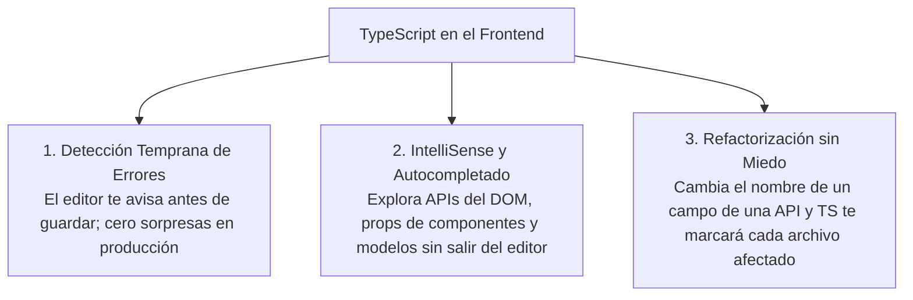
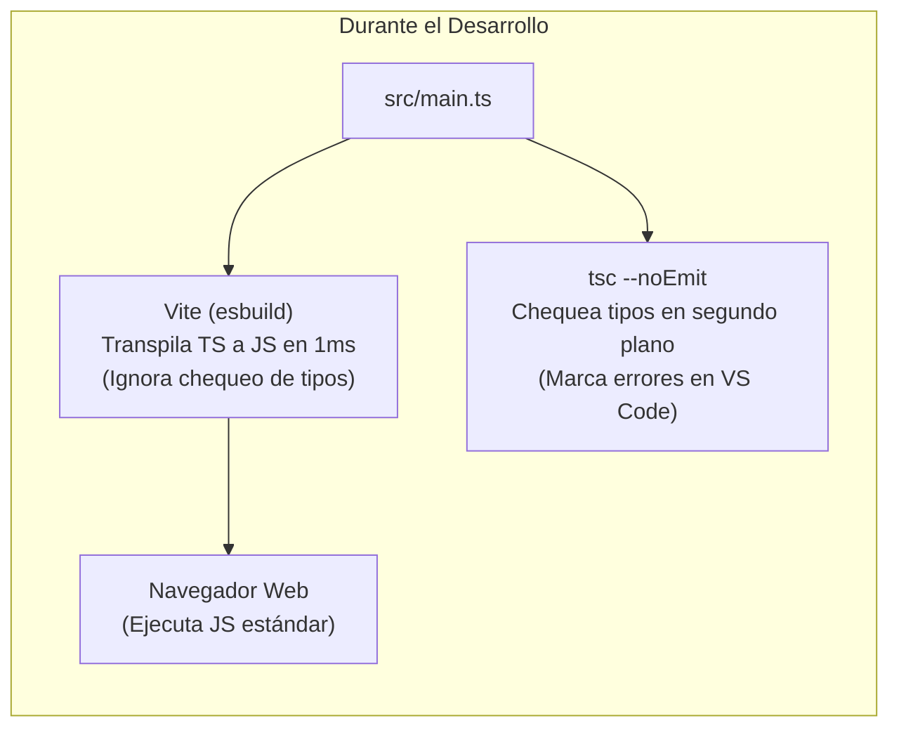

# Módulo 1: El Rol de TypeScript en el Frontend y Configuración

> 🎯 **Prerrequisito:** Esta pista asume que ya conoces los fundamentos de programación (algoritmos, variables, funciones y estructuras de control). Si necesitas repasar las bases de la lógica computacional, consulta primero [Fundamentos de Programación](/fundamentos/01-pensamiento-computacional).

En el desarrollo Frontend moderno, JavaScript por sí solo presenta un desafío crítico: es un lenguaje de **tipado dinámico y débil**. Un error tipográfico en una propiedad de un objeto o asumir que una respuesta de red contiene un dato que viene como `undefined` provoca una pantalla en blanco y la caída de la aplicación frente al usuario final.

**TypeScript** transforma el desarrollo web introduciendo un sistema de **tipado estático y análisis en tiempo de compilación**, actuando como un escudo protector mientras escribes código.

---

## 1.1 Las Tres Grandes Ventajas en el Frontend



1. **Detección temprana de errores:** Los errores se detectan en tu editor (en tiempo de desarrollo), no cuando el usuario hace clic en el botón de pagar.
2. **Autocompletado inteligente (IntelliSense):** Al interactuar con el DOM o librerías externas, VS Code te muestra exactamente qué propiedades y métodos existen.
3. **Refactorización guiada por el compilador:** Si una API cambia la propiedad `user_name` por `username`, cambiar el tipo alertará inmediatamente cada línea de código que deba actualizarse.

---

## 1.2 Configuración Óptima del `tsconfig.json` para Frontend

El archivo `tsconfig.json` es el cerebro del compilador. Para una aplicación web moderna (con Vite, Vue o React), esta es la configuración profesional recomendada:

```json
{
  "compilerOptions": {
    /* 1. Entorno de Ejecución y Lenguaje */
    "target": "ESNext",
    "useDefineForClassFields": true,
    "module": "ESNext",
    "lib": ["ESNext", "DOM", "DOM.Iterable"],
    
    /* 2. Resolución de Módulos (Vite / Empaquetadores modernos) */
    "moduleResolution": "bundler",
    "allowImportingTsExtensions": true,
    "resolveJsonModule": true,
    "isolatedModules": true,
    "noEmit": true,
    
    /* 3. Modo Estricto y Seguridad (¡No negociable!) */
    "strict": true,
    "noUnusedLocals": true,
    "noUnusedParameters": true,
    "noFallthroughCasesInSwitch": true,
    "skipLibCheck": true
  },
  "include": ["src/**/*.ts", "src/**/*.d.ts", "src/**/*.vue", "src/**/*.tsx"]
}
```

### Opciones Clave Explicadas:

* **`"lib": ["DOM", "DOM.Iterable", "ESNext"]`:** **Indispensable.** Le indica al compilador que conocemos las APIs globales del navegador (`window`, `document`, `localStorage`, `fetch`, `MouseEvent`, etc.). Sin `"DOM"`, TypeScript no sabrá qué es un `document.querySelector`.
* **`"strict": true`:** Activa todas las comprobaciones estrictas de tipo. En particular activa:
  * `strictNullChecks`: No permite usar una variable que pueda ser `null` o `undefined` sin antes verificarla.
  * `noImplicitAny`: Marca error si olvidas tipar un parámetro y TypeScript no puede inferirlo.
* **`"moduleResolution": "bundler"`:** Es el estándar moderno introducido en TS 5.x para herramientas como Vite, esbuild o Webpack 5.
* **`"noEmit": true`:** Como Vite se encarga de empaquetar el código, TypeScript solo se usa para validar tipos, no para generar archivos `.js` en disco.

---

## 1.3 El Flujo de Trabajo Moderno: Transpilación vs Chequeo de Tipos

Es fundamental comprender que en proyectos web modernos existen dos herramientas trabajando en equipo:



1. **Vite (con esbuild):** Toma tus archivos `.ts` y elimina la sintaxis de tipos en milisegundos para que el navegador recargue al instante (HMR). No valida tipos en profundidad para ser ultrarrápido.
2. **TypeScript (`tsc --noEmit`):** Corre en segundo plano en tu editor y en tu pipeline de CI/CD para garantizar que no haya ninguna incoherencia de tipos antes de subir a producción.

---

## 1.4 Anatomía del Modo Estricto: `strictNullChecks`

La opción más transformadora de `strict: true` es **`strictNullChecks`**. En JavaScript común, `null` y `undefined` son asignables a cualquier tipo, lo que origina el famoso error de producción: `"Cannot read properties of null"`.

Con `strictNullChecks: true`:

```typescript
// ❌ Con strict: true, esto es un error inmediato:
// let nombre: string = null; // Type 'null' is not assignable to type 'string'.

// ✅ Debes declarar explícitamente si un valor puede faltar:
let nombre: string | null = null;

// Y TypeScript te obligará a comprobarlo antes de usarlo:
function mostrarNombre(n: string | null) {
  // console.log(n.toUpperCase()); // ❌ Error: 'n' is possibly 'null'.
  
  if (n !== null) {
    console.log(n.toUpperCase()); // ✅ Seguro: TS sabe que aquí 'n' es string
  }
}
```

---

## 🛠️ Reto Práctico del Módulo

**Auditoría de Configuración:**

1. Crea un proyecto web con Vite: `npm create vite@latest prueba-ts -- --template vanilla-ts`.
2. Abre `tsconfig.json` y verifica si `strict` está en `true` y si la librería `"DOM"` está presente en `lib`.
3. Crea una función en `src/main.ts` que intente leer una propiedad de un elemento del DOM (`document.querySelector('#titulo')`) sin comprobar si es `null`.
4. Observa cómo TypeScript te impide compilar y corrige el código utilizando una verificación de nulidad (`if (titulo) { ... }`).
