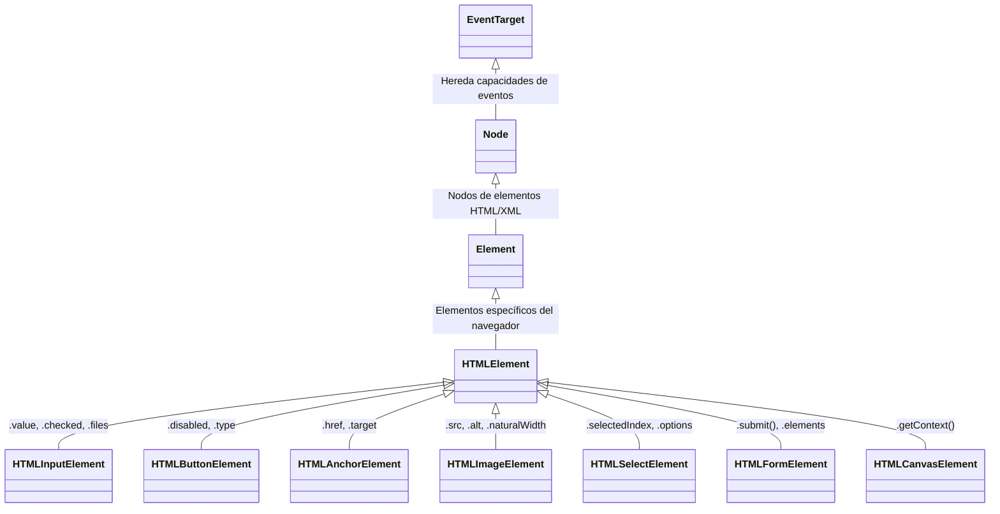

# Módulo 2: El DOM Tipado y Null-Safety

Manipular el Document Object Model (DOM) en JavaScript plano suele ser una fuente constante de errores: intentar leer `.value` en un elemento que no es un input, o invocar métodos sobre un elemento que no existía en el HTML y era `null`. TypeScript convierte el DOM en un entorno completamente predecible y seguro.

---

## 2.1 La Jerarquía de Tipos del DOM

En los tipos estándar de TypeScript (`lib.dom.d.ts`), cada etiqueta HTML pertenece a una jerarquía de herencia bien definida:



### ¿Por qué importa conocer el subtipo específico?
Si seleccionas un elemento como un simple `HTMLElement`, TypeScript **no te dejará** acceder a propiedades exclusivas:

```typescript
// ❌ HTMLElement genérico no tiene la propiedad 'value':
const elemento = document.getElementById("correo"); // Retorna HTMLElement | null
// console.log(elemento.value); // Error: Property 'value' does not exist on type 'HTMLElement'.

// ✅ Con el subtipo HTMLInputElement:
const inputCorreo = document.getElementById("correo") as HTMLInputElement | null;
if (inputCorreo) {
  console.log(inputCorreo.value); // ✅ Funciona y tiene autocompletado
}
```

---

## 2.2 Selección Segura de Elementos: Genéricos vs Casting

Existen dos formas principales de capturar elementos del DOM con su tipo correcto:

### Opción A: Paso de Genérico en `querySelector` (Recomendada)
`document.querySelector` acepta un parámetro de tipo genérico entre corchetes angulares `<...>`:

```typescript
// TypeScript sabe que 'inputEmail' es HTMLInputElement | null
const inputEmail = document.querySelector<HTMLInputElement>("#email-field");

// TypeScript sabe que 'botonEnviar' es HTMLButtonElement | null
const botonEnviar = document.querySelector<HTMLButtonElement>(".btn-submit");

if (botonEnviar) {
  botonEnviar.disabled = true; // TS conoce la propiedad .disabled
}
```

### Opción B: Aserción de Tipo con `as` (*Type Casting*)
Se usa cuando el método no acepta genéricos directos, como `document.getElementById`:

```typescript
const formulario = document.getElementById("registro-form") as HTMLFormElement | null;
```

---

## 2.3 Colecciones del DOM: `NodeList` vs `HTMLCollection`

Cuando seleccionas múltiples elementos (`querySelectorAll` o `getElementsByClassName`), el navegador devuelve colecciones que no son arrays verdaderos:

```typescript
// querySelectorAll devuelve NodeList<T>
const botones = document.querySelectorAll<HTMLButtonElement>(".btn-accion");

// NodeList tiene .forEach(), pero NO tiene .map(), .filter() ni .reduce()
botones.forEach(btn => {
  btn.style.opacity = "0.8";
});
```

### Conversión Segura a Array con `Array.from()`
Para aplicar métodos funcionales (`map`, `filter`), convierte la lista a un array tipado:

```typescript
// Convertimos NodeList a HTMLButtonElement[] real:
const arrayBotones: HTMLButtonElement[] = Array.from(botones);

// Ahora tenemos acceso a todo el poder de los arrays:
const botonesHabilitados = arrayBotones.filter(btn => !btn.disabled);
```

---

## 2.4 El Peligro del Operador Non-Null Assertion (`!`)

TypeScript incluye el símbolo de exclamación `!` al final de una expresión (*Non-null Assertion Operator*). Le dice al compilador: *"Confía en mí, estoy 100% seguro de que esto no es null ni undefined"*.

```typescript
// ❌ Práctica riesgosa:
const boton = document.querySelector<HTMLButtonElement>("#btn-login")!;
boton.click(); 
// Si alguien cambia el ID en el HTML o el script se carga antes del DOM,
// el navegador arrojará: Uncaught TypeError: Cannot read properties of null (reading 'click')
```

> [!CAUTION]
> **Evita el operador `!` en operaciones del DOM.**
> Salvo en pruebas de concepto de una sola línea, trata siempre los elementos del DOM como potencialmente nulos usando **Cláusulas de Guarda** o encadenamiento opcional (`?.`):

```typescript
// ✅ Código defensivo y profesional:
const boton = document.querySelector<HTMLButtonElement>("#btn-login");

if (!boton) {
  console.warn("El botón #btn-login no fue encontrado en el documento.");
} else {
  boton.addEventListener("click", () => console.log("Clickeado"));
}
```

---

## 2.5 Manipulación de Estilos, Clases y Atributos

TypeScript proporciona autocompletado estricto para las propiedades CSS y atributos de datos:

```typescript
const caja = document.querySelector<HTMLDivElement>(".box");

if (caja) {
  // 1. Estilos en línea: Autocompletado completo de CSS en camelCase
  caja.style.backgroundColor = "navy";
  caja.style.display = "flex";
  caja.style.borderRadius = "8px";

  // 2. Manipulación de clases con classList
  caja.classList.add("activo", "sombra-suave");
  caja.classList.remove("oculto");
  const tieneClase = caja.classList.contains("activo"); // boolean

  // 3. Atributos data-* mediante dataset
  // Si en el HTML tienes: <div data-user-id="42">
  const userId = caja.dataset.userId; // string | undefined
}
```

---

## 🛠️ Reto Práctico del Módulo

**Ejercicio: Calculadora de Descuentos con DOM Tipado**

Dado el siguiente formulario en HTML:

```html
<form id="calc-form">
  <input type="number" id="precio-base" placeholder="Precio original" />
  <select id="categoria">
    <option value="0.10">Estudiante (10%)</option>
    <option value="0.20">Profesor (20%)</option>
    <option value="0.50">VIP (50%)</option>
  </select>
  <button type="submit" id="btn-calcular">Calcular</button>
</form>
<p id="resultado-texto"></p>
```

**Tu misión en TypeScript:**
1. Selecciona el formulario, los inputs, el select y el párrafo de resultado utilizando tipos específicos (`HTMLFormElement`, `HTMLInputElement`, `HTMLSelectElement`, etc.) sin usar el operador `!`.
2. Escucha el evento `submit` del formulario de forma segura.
3. Lee el valor del precio con `precioInput.valueAsNumber` (una propiedad nativa exclusiva de `HTMLInputElement`).
4. Lee el porcentaje seleccionado en el `HTMLSelectElement`.
5. Calcula el precio final con descuento y muestra el mensaje en `resultadoTexto.textContent`.
