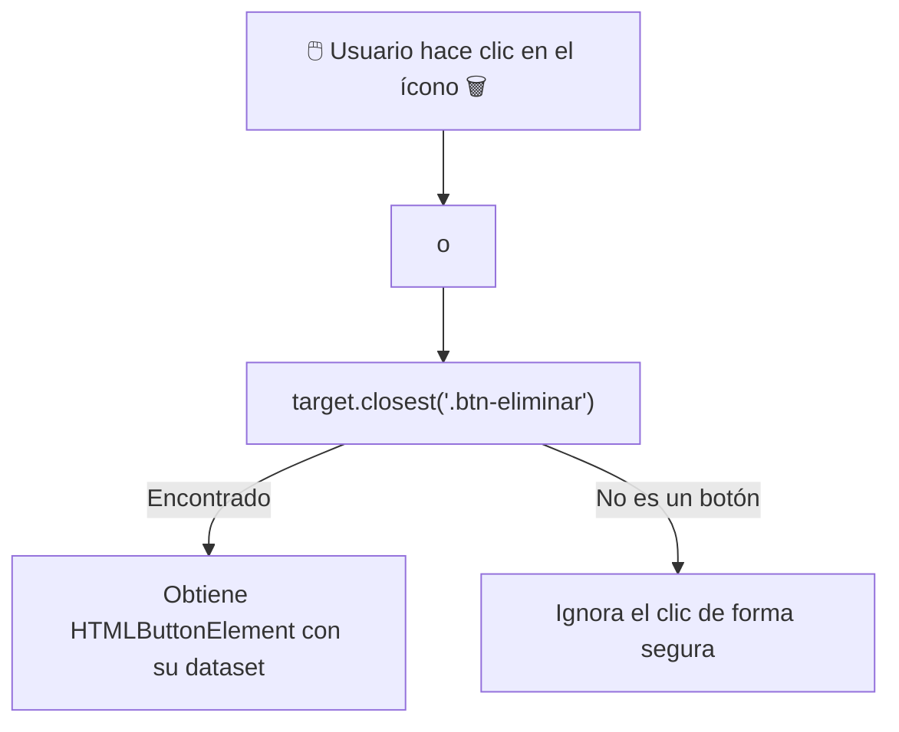

# Módulo 3: Eventos del Navegador y Formularios

Toda la interactividad de la web depende de escuchar y reaccionar a las acciones del usuario: clics de ratón, pulsaciones de teclas, arrastre de archivos y envíos de formularios. En este módulo aprenderás a tipar eventos y formularios sin caer en los errores más habituales de casting.

---

## 3.1 Catálogo de Eventos del Navegador

TypeScript cuenta con tipos dedicados para cada categoría de interacción del usuario:

| Tipo de Evento | Cuándo se usa | Propiedades Clave |
| :--- | :--- | :--- |
| **`MouseEvent`** | `click`, `dblclick`, `mousemove`, `mouseenter` | `clientX`, `clientY`, `button`, `altKey`, `shiftKey` |
| **`KeyboardEvent`** | `keydown`, `keyup`, `keypress` | `key`, `code`, `ctrlKey`, `repeat` |
| **`SubmitEvent`** | `submit` en formularios | `submitter` (el botón que provocó el envío) |
| **`FocusEvent`** | `focus`, `blur` | `relatedTarget` |
| **`InputEvent` / `Event`** | `input`, `change` en campos de texto | `data`, `inputType` |
| **`DragEvent`** | Arrastrar y soltar (*Drag & Drop*) | `dataTransfer` (archivos arrastrados) |

```typescript
const cajaArrastrable = document.querySelector<HTMLDivElement>("#caja");

cajaArrastrable?.addEventListener("dragstart", (e: DragEvent) => {
  e.dataTransfer?.setData("text/plain", "ID-123");
});
```

---

## 3.2 `event.target` vs `event.currentTarget`: El Gran Dolor de Cabeza

Uno de los errores más frustrantes en TypeScript ocurre al intentar leer `.value` dentro de un listener de eventos:

```typescript
const input = document.querySelector<HTMLInputElement>("#buscador");

input?.addEventListener("input", (event) => {
  // ❌ Error clásico con event.target:
  // console.log(event.target.value); 
  // Error: Property 'value' does not exist on type 'EventTarget'.
});
```

### ¿Por qué ocurre esto?
* **`event.target`:** Es el elemento **más profundo que disparó el evento original** (puede ser un `<span>` o un `<i>` dentro de un botón). Su tipo en TS es el genérico `EventTarget`, que no tiene `.value`.
* **`event.currentTarget`:** Es el elemento **al que le agregaste el `addEventListener`**. En TypeScript, `currentTarget` conserva el tipo del elemento que escucha.

```typescript
// ✅ Solución 1: Usar event.currentTarget
input?.addEventListener("input", (event) => {
  const elemento = event.currentTarget as HTMLInputElement;
  console.log(elemento.value); // ✅ Funciona
});

// ✅ Solución 2: Tipar la función manejadora con el tipo de evento específico
const manejarBusqueda = (event: Event) => {
  const target = event.target as HTMLInputElement;
  console.log("Término buscado:", target.value);
};
```

---

## 3.3 Formularios y Extracción con `FormData`

Para procesar formularios sin librerías externas, la forma moderna y recomendada es la API nativa **`FormData`**:

```typescript
interface DatosRegistro {
  nombre: string;
  correo: string;
  rol: "desarrollador" | "diseñador";
  aceptaTerminos: string; // Los checkboxes envían "on" o no están presentes
}

const formulario = document.querySelector<HTMLFormElement>("#registro-form");

formulario?.addEventListener("submit", (e: SubmitEvent) => {
  // 1. Evitar la recarga automática de la página en el navegador
  e.preventDefault();

  // 2. Crear instancia de FormData a partir del formulario actual
  const formData = new FormData(e.currentTarget as HTMLFormElement);

  // 3. Convertir los campos a un objeto plano tipado
  const valores = Object.fromEntries(formData.entries()) as unknown as DatosRegistro;

  console.log(`Registrando a ${valores.nombre} con correo ${valores.correo}`);
});
```

---

## 3.4 Delegación de Eventos Tipada (*Event Delegation*)

Cuando tienes una lista dinámica de cientos de elementos (por ejemplo, una lista de tareas o un catálogo de productos), agregar un listener a cada botón individual consume mucha memoria. 

El patrón de **Delegación de Eventos** escucha los clics en el contenedor padre y utiliza el método `.closest()`:

```typescript
const listaTareas = document.querySelector<HTMLUListElement>("#lista-tareas");

listaTareas?.addEventListener("click", (event: MouseEvent) => {
  const target = event.target as HTMLElement;

  // Buscamos si el clic ocurrió dentro de un botón de eliminar
  const botonEliminar = target.closest<HTMLButtonElement>(".btn-eliminar");

  if (botonEliminar) {
    const tareaId = botonEliminar.dataset.id;
    console.log(`Eliminando tarea con ID: ${tareaId}`);
  }
});
```



---

## 3.5 Eventos de Teclado y Teclas Específicas

Para atajos de teclado o búsquedas en vivo al presionar `Enter`:

```typescript
const inputChat = document.querySelector<HTMLInputElement>("#mensaje-input");

inputChat?.addEventListener("keydown", (e: KeyboardEvent) => {
  if (e.key === "Enter" && !e.shiftKey) {
    e.preventDefault(); // Evita saltos de línea indeseados
    console.log("Enviando mensaje:", e.currentTarget?.value);
  } else if (e.key === "Escape") {
    inputChat.value = ""; // Limpiar input al pulsar Esc
  }
});
```

---

## 🛠️ Reto Práctico del Módulo

**Ejercicio: Gestor de Tareas Interactivo (Todo App)**

Crea un script en TypeScript que gestione una lista de tareas:
1. Escucha el evento `submit` de un formulario para agregar una nueva tarea.
2. Lee el texto del input asegurando que no esté vacío.
3. Inserta dinámicamente un nuevo elemento `<li>` en la lista con el texto y un botón con la clase `.btn-completar` y `.btn-borrar`.
4. Utiliza **Delegación de Eventos** en el `<ul>` padre para:
   * Al hacer clic en `.btn-completar`, alternar una clase CSS `.tachado`.
   * Al hacer clic en `.btn-borrar`, eliminar el elemento `<li>` correspondiente del DOM.
5. Garantiza que no exista ninguna advertencia de tipo ni aserción no segura en todo el script.
