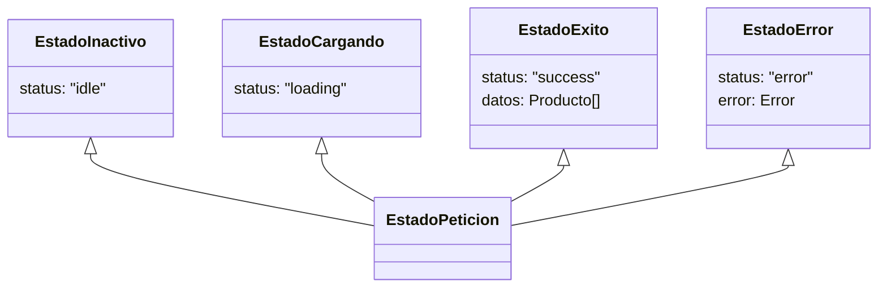

# Módulo 4: Tipado de Estado y Uniones Discriminadas

Uno de los mayores errores arquitectónicos en aplicaciones de Frontend es modelar el estado mediante variables booleanas independientes. En este módulo aprenderás el patrón de diseño más elegante y robusto de TypeScript: las **Uniones Discriminadas (*Discriminated Unions*)**, y cómo eliminar de raíz los estados imposibles en tus interfaces.

---

## 4.1 El Problema de los Estados Imposibles

Imagina cómo muchos desarrolladores novatos modelan la carga de datos en un componente de Vue o React:

```typescript
// ❌ Antipatrón de banderas booleanas sueltas:
interface EstadoComponente {
  cargando: boolean;
  error: boolean;
  mensajeError: string | null;
  datos: Producto[] | null;
}
```

### ¿Por qué este modelo es peligroso?
Permite combinaciones de datos que en la vida real son completamente contradictorias:
* ¿Qué pasa si `cargando` es `true` y `error` también es `true`? ¿Qué debe pintar la pantalla: el spinner de carga o el mensaje de error?
* ¿Qué pasa si `error` es `true` pero `mensajeError` es `null`?
* Tienes que escribir condicionales defensivos gigantescos para cada combinación posible.

---

## 4.2 La Solución: Uniones Discriminadas (*Discriminated Unions*)

Una **Unión Discriminada** consiste en definir cada estado posible como una interfaz independiente que comparte una **propiedad discriminante común** con un tipo literal de string (por ejemplo: `status`, `tipo` o `kind`):



```typescript
// ✅ Cada estado modela exactamente la información que necesita y NADA MÁS:
interface EstadoInactivo {
  status: "idle";
}

interface EstadoCargando {
  status: "loading";
}

interface EstadoExito<T> {
  status: "success";
  datos: T;
}

interface EstadoError {
  status: "error";
  error: Error;
}

// Unión de todos los estados posibles:
type EstadoPeticion<T> = 
  | EstadoInactivo 
  | EstadoCargando 
  | EstadoExito<T> 
  | EstadoError;
```

### ¿Qué ganamos con esto?
1. **Es imposible estar en dos estados a la vez:** No puedes estar en `"loading"` y tener `status: "error"`.
2. **TypeScript estrecha (*narrows*) los tipos automáticamente:** En cuanto verificas `if (estado.status === "success")`, TypeScript **sabe con 100% de certeza** que `estado.datos` existe y nunca será `null`.

```typescript
function renderizarUI(estado: EstadoPeticion<string[]>) {
  switch (estado.status) {
    case "idle":
      return "<button>Cargar datos</button>";
    case "loading":
      return "<div class='spinner'>Cargando...</div>";
    case "success":
      // Aquí adentro, TypeScript sabe que 'datos' existe y es string[]:
      return `<ul>${estado.datos.map(d => `<li>${d}</li>`).join("")}</ul>`;
    case "error":
      // Aquí adentro, TypeScript sabe que existe 'error':
      return `<p class='error'>Error: ${estado.error.message}</p>`;
  }
}
```

---

## 4.3 Verificación Exhaustiva con el Tipo `never` (*Exhaustiveness Checking*)

Imagina que seis meses después, otro miembro de tu equipo agrega un nuevo estado a la unión:

```typescript
interface EstadoVacio {
  status: "empty";
  mensaje: string;
}

type EstadoPeticion<T> = 
  | EstadoInactivo 
  | EstadoCargando 
  | EstadoExito<T> 
  | EstadoError 
  | EstadoVacio; // ✨ Nuevo estado agregado
```

Si en alguna pantalla olvidó agregar el `case "empty"`, la aplicación fallará silenciosamente sin renderizar nada.

Para evitar esto, implementamos la técnica de **Comprobación Exhaustiva** usando el tipo `never` en la cláusula `default`:

```typescript
function renderizarSeguro(estado: EstadoPeticion<string[]>): string {
  switch (estado.status) {
    case "idle":
      return "Inicio";
    case "loading":
      return "Cargando...";
    case "success":
      return `Datos: ${estado.datos.length}`;
    case "error":
      return `Fallo: ${estado.error.message}`;
    
    // Si olvidamos agregar case "empty", TypeScript marcará este error en default:
    default: {
      // 🚨 Error de compilación: Type 'EstadoVacio' is not assignable to type 'never'.
      const _casoNoManejado: never = estado;
      throw new Error(`Estado no contemplado: ${_casoNoManejado}`);
    }
  }
}
```

> [!TIP]
> **El patrón `assertNever`:**
> Si la función compila correctamente con `const _exhaustivo: never = estado`, tienes la **garantía matemática** de que cada posible caso fue considerado en tu `switch`.

---

## 4.4 Caso Real en Frontend: Modales y Ventanas Emergentes

Otro uso cotidiano de uniones discriminadas es modelar diálogos o modales con diferentes propiedades según su propósito:

```typescript
type ModalConfig =
  | { tipo: "ALERTA"; mensaje: string }
  | { tipo: "CONFIRMACION"; mensaje: string; onConfirmar: () => void; textoBoton?: string }
  | { tipo: "FORMULARIO"; titulo: string; campos: string[]; onGuardar: (valores: any) => void };

function abrirModal(modal: ModalConfig) {
  if (modal.tipo === "CONFIRMACION") {
    // TypeScript te permite acceder a onConfirmar
    modal.onConfirmar();
  }
  // Si intentas acceder a modal.onConfirmar en tipo "ALERTA", TS te protegerá con un error.
}
```

---

## 🛠️ Reto Práctico del Módulo

**Ejercicio: Pasarela de Pago con Estados Discriminados**

Modela el proceso de pago de una tienda en línea:
1. Define las interfaces para los estados:
   * `CheckoutIniciado`: `{ status: "INICIADO"; total: number }`
   * `CheckoutProcesando`: `{ status: "PROCESANDO"; metodoPago: "TARJETA" | "PAYPAL" }`
   * `CheckoutCompletado`: `{ status: "COMPLETADO"; folioTransaccion: string; reciboUrl: string }`
   * `CheckoutFallido`: `{ status: "FALLIDO"; codigoError: number; reintentable: boolean }`
2. Define la unión de tipos `EstadoCheckout`.
3. Escribe una función `procesarRespuestaCheckout(estado: EstadoCheckout): string` que implemente un `switch` con **Verificación Exhaustiva (`never`)** en el bloque `default`.
4. Añade deliberadamente un quinto estado `CheckoutCancelado` a la unión y observa cómo TypeScript se niega a compilar hasta que agregues el `case` correspondiente en tu función.
