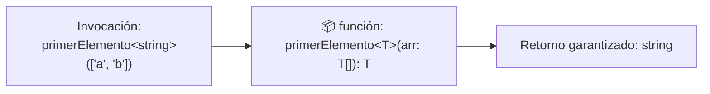

# Módulo 5: Genéricos Aplicados al Frontend

En JavaScript puro, para crear una función o componente reutilizable que sirva para cualquier tipo de dato, se suele sacrificar la seguridad de tipos. Los **Genéricos** son la herramienta que permite escribir código altamente flexible y abstracto **sin perder jamás el autocompletado ni la seguridad de tipos**.

---

## 5.1 ¿Qué es un Genérico? (El Marcador de Posición `<T>`)

Piensa en un genérico como una **variable de tipos**. Así como pasas un argumento a una función (`saludar("Aldair")`), con los genéricos le pasas un tipo a una función, interfaz o clase (`ApiResponse<Usuario>`):



```typescript
// 'T' es un marcador de posición que se resolverá en tiempo de compilación:
function primerElemento<T>(lista: T[]): T | undefined {
  return lista[0];
}

// Inferencia automática de TypeScript:
const primerNumero = primerElemento([10, 20, 30]);      // TypeScript sabe que es 'number'
const primerTexto = primerElemento(["hola", "mundo"]); // TypeScript sabe que es 'string'
```

---

## 5.2 Interfaces Genéricas para Respuestas de Servidor

Casi todas las APIs REST del mundo devuelven una envoltura estándar: un código de estado, un mensaje y una propiedad `data`. Lo único que cambia de una ruta a otra es el contenido de `data`:

```typescript
// Envoltura genérica estándar para cualquier endpoint:
interface ApiResponse<T> {
  status: "success" | "error";
  codigoHttp: number;
  mensaje: string;
  data: T;
  timestamp: string;
}

// Modelos específicos de nuestra aplicación:
interface PerfilUsuario {
  id: number;
  username: string;
  email: string;
}

interface ArticuloBlog {
  slug: string;
  titulo: string;
  visitas: number;
}

// Reutilizamos la misma interfaz ApiResponse para diferentes endpoints:
type RespuestaUsuario = ApiResponse<PerfilUsuario>;
type RespuestaArticulos = ApiResponse<ArticuloBlog[]>;
```

### Respuestas Paginadas Reutilizables
Para listados con páginas (*Pagination*):

```typescript
interface PaginatedList<T> {
  items: T[];
  paginaActual: number;
  totalPaginas: number;
  totalElementos: number;
}

type CatalogoPaginado = ApiResponse<PaginatedList<ArticuloBlog>>;
```

---

## 5.3 Restricciones Genéricas con `extends`

A veces no quieres que `T` sea absolutamente cualquier cosa; necesitas garantizar que cumpla con una estructura básica. Para eso usamos la palabra clave `extends`:

```typescript
interface EntidadConId {
  id: string | number;
}

// Exigimos que cualquier objeto pasado a esta función tenga al menos una propiedad 'id':
function indexarPorId<T extends EntidadConId>(elementos: T[]): Record<string, T> {
  const mapa: Record<string, T> = {};
  
  elementos.forEach(item => {
    mapa[String(item.id)] = item;
  });

  return mapa;
}

const productos = [
  { id: 101, nombre: "Teclado", precio: 50 },
  { id: 102, nombre: "Mouse", precio: 25 }
];

const mapaProductos = indexarPorId(productos);
console.log(mapaProductos["101"].nombre); // ✅ Autocompletado completo de 'nombre' y 'precio'
```

---

## 5.4 Genéricos en Arrow Functions y la Trampa de JSX/TSX

Cuando escribes una función flecha genérica en un archivo `.tsx` (React), el compilador puede confundir `<T>` con una etiqueta HTML abierta no cerrada:

```typescript
// ❌ En archivos .tsx esto arroja error de sintaxis JSX:
// const extraer = <T>(dato: T) => dato;

// ✅ Solución 1: Añadir una coma para desambiguar de JSX:
const extraer = <T,>(dato: T): T => dato;

// ✅ Solución 2: Usar una restricción básica 'extends unknown':
const envolver = <T extends unknown>(dato: T): T => dato;
```

---

## 5.5 Clases Genéricas: Cache en Memoria del Cliente

Un caso de uso práctico en Frontend es construir un almacén de caché local para evitar peticiones repetidas a la red:

```typescript
class MemoriaCache<T> {
  private cache = new Map<string, { dato: T; expiracion: number }>();

  guardar(clave: string, valor: T, ttlSegundos: number = 60): void {
    const expiracion = Date.now() + ttlSegundos * 1000;
    this.cache.set(clave, { dato: valor, expiracion });
  }

  obtener(clave: string): T | null {
    const registro = this.cache.get(clave);
    if (!registro) return null;

    if (Date.now() > registro.expiracion) {
      this.cache.delete(clave); // Expirado
      return null;
    }

    return registro.dato;
  }
}

// Uso para usuarios:
const cacheUsuarios = new MemoriaCache<PerfilUsuario>();
cacheUsuarios.guardar("user_1", { id: 1, username: "aldair", email: "a@web.com" }, 120);

const user = cacheUsuarios.obtener("user_1"); // Retorna PerfilUsuario | null
```

---

## 🛠️ Reto Práctico del Módulo

**Ejercicio: Utilidad Genérica de Filtrado y Ordenamiento**

Escribe una función genérica llamada `ordenarColeccion<T, K extends keyof T>(items: T[], campo: K, orden: "ASC" | "DESC" = "ASC"): T[]` que:
1. Acepte un array de cualquier tipo de objeto.
2. Asegure mediante `keyof T` que el `campo` recibido sea obligatoriamente una propiedad real de los objetos de la lista.
3. Devuelva una **copia nueva ordenada** del array según el campo especificado sin mutar la lista original.
4. Pruébalo con una lista de productos ordenando por `precio` y con una lista de usuarios ordenando por `username`.
