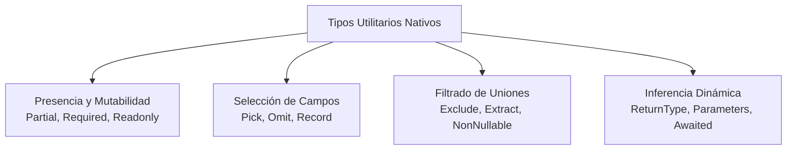

# Módulo 6: Tipos Utilitarios Indispensables

En el desarrollo Frontend profesional, una de las peores prácticas es copiar y pegar interfaces con pequeñas variaciones (por ejemplo: `Usuario`, `UsuarioSinId`, `UsuarioConCamposOpcionales`, `UsuarioSoloLectura`). 

TypeScript incluye **Tipos Utilitarios (*Utility Types*)** globales que permiten transformar tipos existentes de forma programática.

---

## 6.1 Catálogo de Utility Types Esenciales



---

## 6.2 Presencia y Mutabilidad: `Partial`, `Required` y `Readonly`

Tomemos como base la interfaz de un producto de comercio electrónico:

```typescript
interface Producto {
  id: number;
  sku: string;
  nombre: string;
  precio: number;
  descripcion?: string;
}
```

### 1. `Partial<T>`: Todo se vuelve opcional (`?`)
Esencial para formularios de actualización o endpoints `PATCH`, donde el usuario solo envía los campos que desea modificar:

```typescript
// Todas las propiedades de Producto pasan a ser opcionales:
type ProductoActualizable = Partial<Producto>;

function actualizarProducto(id: number, cambios: Partial<Producto>) {
  // Solo enviamos lo que cambió: { precio: 120 }
}
```

### 2. `Required<T>`: Todo se vuelve obligatorio
Elimina todos los signos `?`, forzando a que todas las propiedades existan:

```typescript
// Ahora 'descripcion' ya no es opcional:
type ProductoCompleto = Required<Producto>;
```

### 3. `Readonly<T>`: Inmutabilidad superficial
Protege el objeto contra reasignaciones de propiedades en tiempo de desarrollo. Muy usado en stores globales:

```typescript
type ProductoInmutable = Readonly<Producto>;

const articulo: ProductoInmutable = {
  id: 1,
  sku: "ABC-1",
  nombre: "Monitor",
  precio: 200
};

// articulo.precio = 250; // ❌ Error: Cannot assign to 'precio' because it is a read-only property.
```

---

## 6.3 Selección y Omisión de Campos: `Pick` y `Omit`

Son los dos tipos utilitarios más usados en la arquitectura de componentes de Frontend:

### 1. `Pick<T, Keys>`: Elige solo las propiedades necesarias
Imagina un componente de tarjeta (*Card*) que solo necesita mostrar el nombre y el precio de un modelo gigante de 40 campos:

```typescript
// Extrae ÚNICAMENTE 'nombre' y 'precio' de Producto:
type TarjetaProductoProps = Pick<Producto, "nombre" | "precio">;

const tarjeta: TarjetaProductoProps = {
  nombre: "Teclado Mecánico",
  precio: 75
};
```

### 2. `Omit<T, Keys>`: Elimina propiedades específicas
Cuando creas un nuevo recurso en un formulario, el backend generará el `id` y las marcas de tiempo (`createdAt`). Por tanto, el formulario necesita el modelo **sin el `id`**:

```typescript
// Elimina 'id' y 'sku' del tipo original:
type FormularioCrearProducto = Omit<Producto, "id" | "sku">;

const nuevoProducto: FormularioCrearProducto = {
  nombre: "Ratón Gamer",
  precio: 45
};
```

---

## 6.4 Diccionarios Tipados con `Record<Keys, Type>`

Crea un tipo de objeto cuyas propiedades son del tipo `Keys` y cuyos valores son del tipo `Type`:

```typescript
type CodigoMoneda = "MXN" | "USD" | "EUR";

// Obliga a que el objeto contenga exactamente las tres monedas como claves:
const tasasDeCambio: Record<CodigoMoneda, number> = {
  MXN: 1.0,
  USD: 18.5,
  EUR: 20.2
};
```

---

## 6.5 Filtrado de Uniones: `Exclude`, `Extract` y `NonNullable`

* **`Exclude<Union, Excluded>`:** Quita valores de una unión.
* **`Extract<Union, Extracted>`:** Extrae solo los valores que coinciden.
* **`NonNullable<T>`:** Elimina `null` y `undefined` de una unión.

```typescript
type EventoMouse = "click" | "dblclick" | "mousemove" | "scroll";

// Queremos solo eventos que impliquen clics:
type SoloClics = Exclude<EventoMouse, "mousemove" | "scroll">; // "click" | "dblclick"

// Eliminar valores nulos:
type EntradaNullable = string | number | null | undefined;
type EntradaLimpia = NonNullable<EntradaNullable>; // string | number
```

---

## 6.6 Inferencia Dinámica: `ReturnType` y `Awaited`

Ahorra tener que reescribir manualmente los tipos de retorno de funciones complejas o librerías externas:

### 1. `ReturnType<typeof funcion>`
Extrae el tipo exacto que retorna una función:

```typescript
function crearUsuarioSesion() {
  return {
    id: 101,
    token: "jwt_secret_token",
    permisos: ["read", "write"] as const
  };
}

// Infiere automáticamente el tipo devuelto sin tener que crear una interfaz a mano:
type Sesion = ReturnType<typeof crearUsuarioSesion>;
```

### 2. `Awaited<T>`
Desempaqueta el tipo interior que resuelve una Promesa asíncrona:

```typescript
async function fetchConfiguracion() {
  return { tema: "dark", version: 2 };
}

// Awaited extrae { tema: string, version: number } en lugar de Promise<...>
type Config = Awaited<ReturnType<typeof fetchConfiguracion>>;
```

---

## 🛠️ Reto Práctico del Módulo

**Ejercicio: Arquitectura CRUD de un Usuario sin Duplicación de Código**

Dada una única interfaz base:

```typescript
interface UsuarioCompleto {
  id: string;
  nombre: string;
  correo: string;
  passwordHash: string;
  rol: "ADMIN" | "CLIENTE";
  fechaRegistro: Date;
  telefono?: string;
}
```

Crea sin redefinir propiedades manualmente los siguientes tipos utilitarios derivados:
1. `UsuarioPublico`: El modelo que verá el frontend (sin `passwordHash` ni `fechaRegistro`). Usa `Omit`.
2. `FormularioRegistro`: Los datos requeridos al crear un usuario (sin `id`, `fechaRegistro` ni `passwordHash`, pero requiere `password: string` adicional mediante intersección `&`).
3. `PerfilEditable`: Los campos que el usuario puede editar en su perfil (todos opcionales, pero solo permitiendo modificar `nombre` y `telefono`). Combina `Partial` y `Pick`.
4. `MapaRolesUsuarios`: Un diccionario que mapee el `id` de cada usuario con su `rol`. Usa `Record`.
