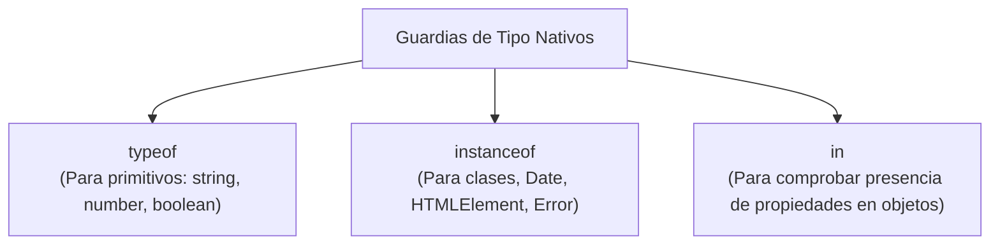

# Módulo 7: Guardias de Tipo y Predicados (`is`)

En aplicaciones reales que consumen APIs externas o eventos del usuario, una variable puede ser de más de un tipo (`string | number`, `Usuario | Admin`, o `unknown`). Los **Guardias de Tipo (*Type Guards*)** y los **Predicados de Tipo (*Type Predicates*)** son las técnicas que permiten a TypeScript saber con certeza matemática qué tipo exacto tiene una variable dentro de un bloque de código condicional.

---

## 7.1 Guardias de Tipo Nativos de JavaScript

TypeScript aprovecha las estructuras de comprobación nativas de JavaScript para estrechar (*narrow*) el tipo automáticamente:



### 1. `typeof`: Para Primitivos
```typescript
function formatearPrecio(valor: string | number) {
  if (typeof valor === "number") {
    return `$${valor.toFixed(2)}`; // TS sabe que es 'number'
  }
  return valor.trim(); // TS sabe que aquí solo puede ser 'string'
}
```

### 2. `instanceof`: Para Instancias de Clases y DOM
```typescript
function manejarError(error: unknown) {
  if (error instanceof Error) {
    console.error("Mensaje de error:", error.message); // TS desbloquea .message
  }
}

function procesarElemento(el: Element) {
  if (el instanceof HTMLImageElement) {
    console.log(el.src); // TS sabe que tiene la propiedad .src
  }
}
```

### 3. El operador `in`: Para Propiedades de Objetos
```typescript
interface UsuarioBasico { id: number; nombre: string }
interface UsuarioEmpresa { id: number; razonSocial: string; rfc: string }

function imprimirIdentidad(u: UsuarioBasico | UsuarioEmpresa) {
  if ("razonSocial" in u) {
    console.log(`Empresa: ${u.razonSocial}`); // TS infiere UsuarioEmpresa
  } else {
    console.log(`Persona: ${u.nombre}`);      // TS infiere UsuarioBasico
  }
}
```

---

## 7.2 Predicados de Tipo (*Type Predicates*): `valor is Tipo`

¿Qué sucede cuando la lógica para comprobar un tipo es compleja y deseas extraerla a una función reutilizable?

```typescript
interface Admin {
  id: number;
  nombre: string;
  rol: "ADMIN";
  permisos: string[];
}

interface Cliente {
  id: number;
  nombre: string;
  rol: "CLIENTE";
}

type Usuario = Admin | Cliente;
```

### ❌ El Problema de las Funciones Booleanas Tradicionales:
```typescript
function verificarSiEsAdmin(u: Usuario): boolean {
  return u.rol === "ADMIN";
}

const persona: Usuario = { id: 1, nombre: "Aldair", rol: "ADMIN", permisos: ["write"] };

if (verificarSiEsAdmin(persona)) {
  // 🚨 Error: TypeScript NO sabe que es Admin, sigue viéndolo como Usuario genérico:
  // console.log(persona.permisos); // Property 'permisos' does not exist on type 'Usuario'.
}
```

### ✅ La Solución: El Predicado de Tipo (`u is Admin`)
Cambiamos el tipo de retorno `: boolean` por la firma `: u is Admin`. Esto le indica formalmente al compilador de TypeScript que si la función devuelve `true`, la variable evaluada adopta ese tipo específico:

```typescript
function esAdmin(u: Usuario): u is Admin {
  return u.rol === "ADMIN";
}

if (esAdmin(persona)) {
  // ✨ ¡Magia!: TypeScript ahora sabe con 100% de certeza que persona es Admin:
  console.log(persona.permisos.join(", ")); // ✅ Autocompletado completo
}
```

---

## 7.3 Filtrado Seguro en Arrays con Type Predicates

Uno de los patrones más elegantes en el desarrollo web es limpiar arrays que contienen valores nulos o tipos mixtos:

```typescript
const listaConNulos: (string | null | undefined)[] = ["React", null, "Vue", undefined, "Svelte"];

// ❌ Con filter común, el tipo devuelto sigue siendo (string | null | undefined)[]:
const resultadoMalo = listaConNulos.filter(item => item !== null && item !== undefined);

// ✅ Con un Type Predicate, el array resultante se limpia a string[] puro:
function noEsNulo<T>(valor: T | null | undefined): valor is T {
  return valor !== null && valor !== undefined;
}

const tecnologiasLimpias: string[] = listaConNulos.filter(noEsNulo);
console.log(tecnologiasLimpias); // ["React", "Vue", "Svelte"] (Tipo: string[])
```

---

## 7.4 Funciones de Aserción (*Assertion Functions* con `asserts`)

A veces no quieres un condicional `if/else`, sino que prefieres lanzar una excepción si los datos no son válidos, garantizando que el resto del archivo pueda asumir que el dato es seguro:

```typescript
function afirmarEsString(val: unknown): asserts val is string {
  if (typeof val !== "string") {
    throw new Error(`Se esperaba una cadena de texto, pero se recibió: ${typeof val}`);
  }
}

const inputDesconocido: unknown = "https://api.miweb.com";

afirmarEsString(inputDesconocido);
// A partir de esta línea hacia abajo, TypeScript sabe que inputDesconocido es 'string':
console.log(inputDesconocido.toUpperCase());
```

---

## 🛠️ Reto Práctico del Módulo

**Ejercicio: Filtro de Notificaciones Polimórficas**

Dada una lista heterogénea de notificaciones recibidas por WebSockets:

```typescript
interface NotificacionEmail {
  tipo: "EMAIL";
  destinatario: string;
  asunto: string;
}

interface NotificacionPush {
  tipo: "PUSH";
  dispositivoToken: string;
  badge: number;
}

type Notificacion = NotificacionEmail | NotificacionPush;

const bandeja: Notificacion[] = [
  { tipo: "EMAIL", destinatario: "ana@web.com", asunto: "Bienvenida" },
  { tipo: "PUSH", dispositivoToken: "tok_abc123", badge: 3 },
  { tipo: "EMAIL", destinatario: "carlos@web.com", asunto: "Factura" }
];
```

**Tu misión:**
1. Crea un Custom Type Guard llamado `esNotificacionEmail(notif: Notificacion): notif is NotificacionEmail`.
2. Utiliza tu Type Guard dentro de un `.filter()` para extraer exclusivamente las notificaciones de tipo email con tipado `NotificacionEmail[]`.
3. Itera la lista filtrada e imprime los asuntos en consola sin necesidad de ningún casting manual `as`.
