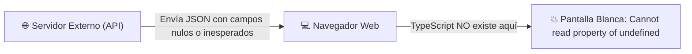
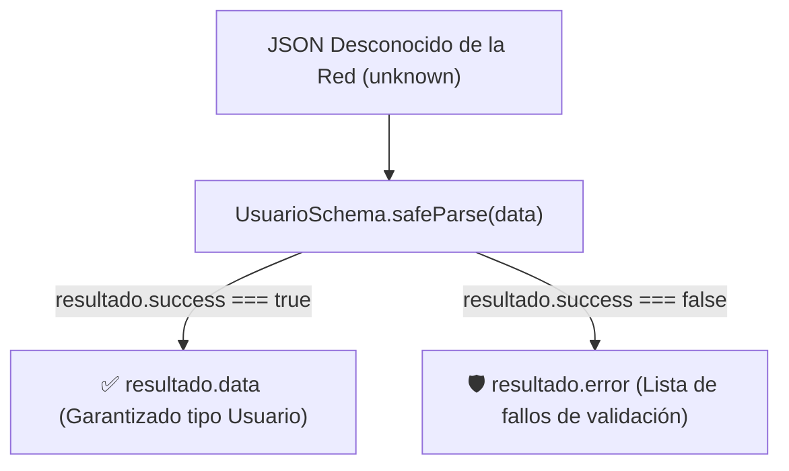

# Módulo 9: Validación en Runtime con Zod

Existe una peligrosa ilusión de seguridad muy extendida entre los programadores novatos: creer que porque una función tiene el tipo `: Promise<Usuario>`, los datos que regresen de internet realmente serán un `Usuario`. 

En este módulo descubrirás por qué **TypeScript solo existe en tiempo de desarrollo**, y cómo **Zod** cierra la brecha validando los datos en tiempo de ejecución.

---

## 9.1 El Gran Límite de TypeScript: Cero Protección en Red

Cuando tu proyecto se compila para producción, **todos los tipos e interfaces de TypeScript desaparecen por completo**. En el navegador solo corre JavaScript estándar.



Si el backend cambia una respuesta o un usuario malicioso envía datos corruptos:

```typescript
interface Usuario {
  id: number;
  nombre: string;
  roles: string[]; // Esperas obligatoriamente un array
}

// ❌ El compilador cree que 'data' es Usuario, pero el backend envió 'roles: null':
const data: Usuario = await fetch("/api/user").then(r => r.json());

// ¡EXPLOTA EN PRODUCCIÓN frente al usuario!:
data.roles.forEach(r => console.log(r)); // TypeError: Cannot read properties of null (reading 'forEach')
```

---

## 9.2 La Solución: Validación de Esquemas con Zod

**Zod** es una librería de declaración y validación de esquemas creada para TypeScript. Te permite definir una estructura que **valida los datos reales en tiempo de ejecución** y, al mismo tiempo, **infiere el tipo de TypeScript automáticamente** sin tener que escribir la interfaz por separado.

```bash
npm install zod
```

### 1. Definición del Esquema con Zod:
```typescript
import { z } from "zod";

// 1. Definimos las reglas de validación en tiempo de ejecución:
export const UsuarioSchema = z.object({
  id: z.number().positive(),
  nombre: z.string().min(2, "El nombre debe tener al menos 2 caracteres"),
  email: z.string().email("Formato de correo inválido"),
  roles: z.array(z.string()).default(["CLIENTE"]),
  edad: z.number().optional()
});
```

---

## 9.3 Inferencia de Tipos con `z.infer` (Principio DRY)

No necesitas escribir una `interface Usuario` a mano. Zod la genera por ti a partir del esquema con `z.infer`:

```typescript
// ✨ TypeScript infiere la interfaz automáticamente:
export type Usuario = z.infer<typeof UsuarioSchema>;

/*
El tipo inferido es exactamente equivalente a:
type Usuario = {
  id: number;
  nombre: string;
  email: string;
  roles: string[];
  edad?: number | undefined;
}
*/
```

---

## 9.4 Validación Segura con `.safeParse()`

Zod ofrece dos métodos para comprobar los datos:
* `.parse(datos)`: Lanza una excepción si los datos no cumplen con las reglas.
* **`.safeParse(datos)` (Recomendado en Frontend):** Devuelve una **Unión Discriminada** indicando si la validación fue exitosa o falló, sin romper el flujo de la aplicación.

```typescript
async function cargarUsuarioSeguro(id: number): Promise<Usuario | null> {
  const respuesta = await fetch(`/api/usuarios/${id}`);
  const jsonDesconocido: unknown = await respuesta.json();

  // Validamos los datos en tiempo de ejecución:
  const resultado = UsuarioSchema.safeParse(jsonDesconocido);

  if (!resultado.success) {
    // Si la API envió datos corruptos, los capturamos con total control:
    console.error("Los datos de la API no cumplen con el contrato:", resultado.error.format());
    return null;
  }

  // Si fue exitoso, TypeScript sabe que resultado.data es de tipo 'Usuario':
  return resultado.data;
}
```



---

## 9.5 Validaciones Prácticas para Formularios Frontend

Zod no solo valida APIs; es la librería estándar para validar formularios en React (con `react-hook-form`) y Vue:

```typescript
export const FormularioRegistroSchema = z.object({
  nombreCompleto: z.string().min(3),
  correo: z.string().email(),
  password: z.string().min(8, "La contraseña debe tener al menos 8 caracteres"),
  confirmarPassword: z.string(),
  // Coerción automática de texto a número (útil para inputs tipo number):
  edad: z.coerce.number().min(18, "Debes ser mayor de edad")
}).refine(data => data.password === data.confirmarPassword, {
  message: "Las contraseñas no coinciden",
  path: ["confirmarPassword"] // Ubica el error en el input de confirmación
});

export type FormularioRegistro = z.infer<typeof FormularioRegistroSchema>;
```

---

## 🛠️ Reto Práctico del Módulo

**Ejercicio: Escudo Defensivo para una API de Clima**

Imagina que consumes un servicio meteorológico de terceros que suele enviar datos inconsistentes:

1. Define un esquema `ClimaSchema` con Zod:
   * `ciudad: string` (mínimo 1 carácter).
   * `temperatura: number` (entre `-50` y `60`).
   * `humedad: number` (entre `0` y `100`).
   * `vientoKm: number` (opcional).
2. Deriva el tipo TypeScript `Clima` usando `z.infer`.
3. Escribe una función de prueba que pase deliberadamente un objeto corrupto `{ ciudad: "", temperatura: 999, humedad: "cien" }` por `ClimaSchema.safeParse()`.
4. Inspecciona la propiedad `resultado.error.issues` e imprime en la consola los mensajes de error amigables para cada campo inválido.
