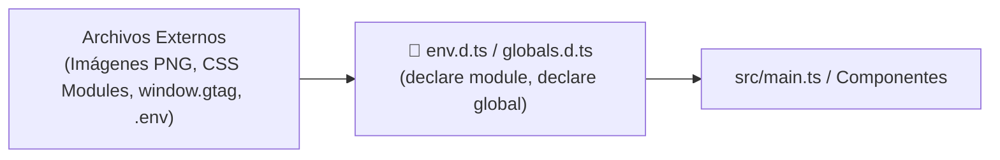

# Módulo 12: Archivos de Declaración (`.d.ts`) y Entorno

En cualquier proyecto web real interactuarás con archivos no TypeScript (imágenes `.svg` o `.png`, hojas de estilo `*.module.css`, scripts de analítica pegados en el HTML como Google Analytics, y variables de entorno de Vite). 

Los **archivos de declaración de tipos (`.d.ts`)** son la herramienta para describirle a TypeScript cosas que existen en el entorno pero que no fueron escritas en código TS.

---

## 12.1 ¿Qué es un Archivo `.d.ts`?

Un archivo `.d.ts` (*Declaration File*) contiene **únicamente declaraciones de tipos**, sin código ejecutable (no genera ningún archivo JavaScript en la compilación). Su función es puramente informativa para el compilador y para VS Code.



---

## 12.2 Tipado de Variables de Entorno en Vite

Por defecto, Vite proporciona la propiedad `import.meta.env`, pero todas las variables personalizadas que crees en tu archivo `.env` tendrán el tipo genérico `any` o `string | undefined`.

Para tener autocompletado y validación estricta de tus variables de entorno, crea o edita el archivo `src/env.d.ts`:

```typescript
/// <reference types="vite/client" />

interface ImportMetaEnv {
  // Solo las variables con prefijo VITE_ son visibles en el cliente:
  readonly VITE_APP_TITLE: string;
  readonly VITE_API_URL: string;
  readonly VITE_PORT: string;
  readonly VITE_ENABLE_ANALYTICS: "true" | "false";
}

interface ImportMeta {
  readonly env: ImportMetaEnv;
}
```

Ahora en cualquier archivo de tu aplicación:

```typescript
// ✅ VS Code te autocompleta exactamente las variables disponibles:
const url = import.meta.env.VITE_API_URL;
// const error = import.meta.env.VITE_VARIABLE_INEXISTENTE; // ❌ Error de compilación
```

---

## 12.3 Declaración de Módulos para Imágenes y Assets

Si intentas importar una imagen en TypeScript (`import logo from "./logo.png"`), TypeScript marcará un error: *"Cannot find module './logo.png' or its corresponding type declarations"*.

Para solucionarlo, declaramos módulos comodín (*Wildcard Modules*) en un archivo `declarations.d.ts`:

```typescript
// Declaración para imágenes rasterizadas:
declare module "*.png" {
  const content: string;
  export default content;
}

declare module "*.jpg" {
  const content: string;
  export default content;
}

declare module "*.webp" {
  const content: string;
  export default content;
}

// Declaración para iconos vectoriales SVG:
declare module "*.svg" {
  const content: string;
  export default content;
}

// Declaración para CSS Modules:
declare module "*.module.css" {
  const classes: { readonly [key: string]: string };
  export default classes;
}
```

---

## 12.4 Extender el Objeto Global `window`

Cuando agregas herramientas de analítica, pasarelas de pago o SDKs externos mediante una etiqueta `<script>` en el `index.html` (como Stripe, PayPal o Google Analytics), el navegador crea propiedades en el objeto global `window`.

Si intentas acceder a `window.gtag`, TypeScript marcará error porque no existe en la especificación estándar del DOM. Puedes extender la interfaz `Window` usando la cláusula `declare global`:

```typescript
// globals.d.ts
export {};

declare global {
  interface Window {
    // Declaramos las propiedades personalizadas inyectadas por scripts externos:
    gtag?: (comando: string, accion: string, opciones?: Record<string, any>) => void;
    dataLayer?: any[];
    Stripe?: (apiKey: string) => any;
  }
}
```

Ahora puedes consumirlo de forma completamente segura:

```typescript
// En tu código TypeScript:
if (window.gtag) {
  window.gtag("event", "compra_completada", { total: 150 });
}
```

---

## 12.5 Tipado de Librerías Externas sin Tipos Oficiales

Si instalas un paquete antiguo de npm que no incluye tipos TypeScript y no tiene paquete en DefinitelyTyped (`@types/nombre-paquete`), puedes crear una declaración de módulo de escape:

```typescript
// vendor.d.ts
declare module "libreria-antigua-sin-tipos" {
  export function iniciarPlugin(config: any): void;
  export const version: string;
}
```

---

## 🛠️ Reto Práctico del Módulo

**Ejercicio: Configuración de Tipos de Entorno para un E-Commerce**

Crea un archivo de declaración `src/types/env.d.ts` que cumpla con los siguientes requisitos:
1. Incluya la referencia a los tipos de cliente de Vite: `/// <reference types="vite/client" />`.
2. Declare las variables de entorno:
   * `VITE_FIREBASE_API_KEY: string`
   * `VITE_TIENDA_MODO: "desarrollo" | "produccion" | "pruebas"`
   * `VITE_MAX_ITEMS_CARRITO: string`
3. Declare soporte para importar archivos de audio `.mp3` devolviendo una cadena con la URL del archivo.
4. Extienda la interfaz `Window` para agregar una propiedad `analyticsTracker` que contenga una función `enviarEvento(nombre: string, datos?: object): void`.
